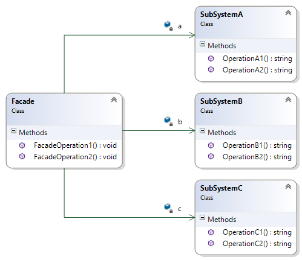
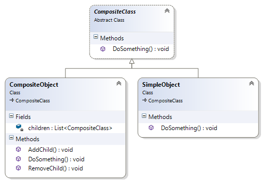
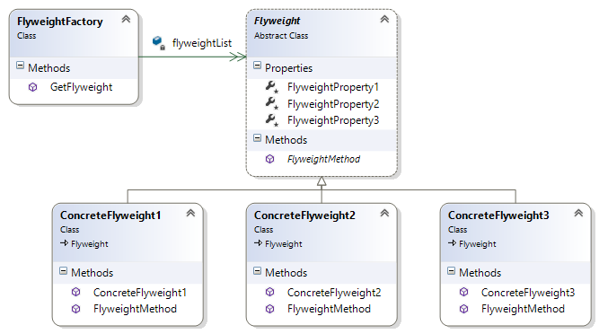

##Façade Design Pattern##

Façade Design Pattern отговаря на **необходимостта** от намаляване на вътрешните зависимости между елементите на системата; на нейната комплексност. При прилагането му се цели намаляване на комуникацията и зависимостите между подсистемите, участващи в системата.

**Целта**, която се преследва с прилагането на Façade Design Pattern е дефиниране на единствен интерфейс на по-високо ниво, който прави по-лесни за използване подсистемите на приложението.
 
Façade Design Pattern е **приложим** при наличие на много зависимости между клиентите на дадена система и различните класове, имплементиращи отделни нейни функционалности.

В софтуерния дизайн, **употребата** на Façade Design Pattern се е наложила в следните случаи:

+  при съчетаване използването на множесво framework-и в една система;
+  при представяне на адресното пространство в интернет;
+  при представяне на адресацията на оперативната памет;

Façade шаблоннът се **имплементира** чрез отделен клас, който съдържа множество прости функции и методи, необходими за използването функционалността на цялата система (респ. отделните, включени в нея подсистеми). От своя страна, това позволява на подсистемите, да имплементират функционалност, която може да се ползва само чрез Façade класа. 

	namespace FacadeDemo
	{
    	public class SubSystemA
    	{
        	public string OperationA1()
        	{
        	    return "Result of Operation A1\n";
        	}

        	public string OperationA2()
        	{
        	    return "Result of Operation A2\n";
        	}
    	}

    	public class SubSystemB
    	{
        	public string OperationB1()
        	{
            	return "Result of Operation B1\n";
        	}

        	public string OperationB2()
        	{
            	return "Result of Operation B2\n";
        	}
    	}

    	public class SubSystemC
    	{
        	public string OperationC1()
        	{
            	return "Result of Operation C1\n";
        	}

        	public string OperationC2()
        	{
            	return "Result of Operation C2\n";
        	}
    	}

		public class Facade
	    {
	        private SubSystemA a = new SubSystemA();
	
	        private SubSystemB b = new SubSystemB();

	        private SubSystemC c = new SubSystemC();

	        public void FacadeOperation1()
	        {
	            Console.WriteLine("Operation 1\n" +
	            this.a.OperationA1() +
	            this.a.OperationA2() +
	            this.b.OperationB1());
	        }
	
	        public void FacadeOperation2()
	        {
	            Console.WriteLine("Operation 2\n" +
	            this.b.OperationB2() +
	            this.c.OperationC1() +
	            this.c.OperationC2());
	        }
	    }
	}

При имплементацията на Façade Pattern **участват** Façade класа и класовете, имплементиращи отделните подсистеми.

+ *Façade класа* е отговорен за обработката на заявките на клиентите. Той знае с помощта на кои подсистеми те могат да бъдат обработени, като насочва клиентските завки към конкретните подсистеми.
+ *Подсистемите* имплементират отделнните функционалности на системата. Те обработват клиентските завки, които се насочват към тях от Façade класа. Подсистемите не пазят референции към Façade класа.

**Следствията** от използването на Façade Pattern са:

+ намаляване броя на обектите, с които клиентът трябва да си взаимодейства;
+ улеснява използването на отделните подсистеми;
+ намалява взаимозависимостите между клиентите и подсистемите;
+ гъвкавост при работа в сравнение с директното използване на класове;

Структура:

## Composite Pattern##

Composite Pattern шаблонът отговаря на **необходимостта** от третиране на прости обекти и структури от обекти (включващи, както прости обекти, така и други структури от обекти) по еднакъв начин.

Composite Pattern шаблонът е **приложим** при построяване на дървовидни структури от обекти, при което е нужно еднаквото представяне на отделни обекти, целии йерархии от обекти и/или части от такива йерархии.

Composite Pattern шаблонът се **употребява**, когато клиентът трябва да обработва по един и същи начин отделните обекти и техните структури. Например при графичните редактори линията може да бъде имплементирана като прост обект, а правоъгълника, като структура от линии.

Composite Pattern шаблонът се **имплементира** чрез абстрактен клас, който дефинира интерфейсите, които всеки елемент на композицията трябва да имплементира. Простите обекти, имплементират методите, дефинирани от абстрактния клас, без да съхраняват референции на наследници. Композитните обектиимплементират методите на абстрактния клас, но съхраняват и списък с референции към свои наследници, които също имплементират методите на абстрактния клас.

	namespace CompositeDemo
	{
	    using System;
	    using System.Collections.Generic;

	    public abstract class CompositeClass
	    {
	        public abstract void DoSomething();
	    }

	    public class SimpleObject : CompositeClass
	    {
	        public override void DoSomething()
	        {
	            Console.WriteLine("Simple object something done!");
	        }
	    }

	    public class CompositeObject : CompositeClass
	    {
	        private List<CompositeClass> children;
	
	        public override void DoSomething()
	        {
	            foreach (var child in this.children)
	            {
	                child.DoSomething();
	            }
	        }

	        public void AddChild(CompositeClass child)
	        {
	            this.children.Add(child);
	        }

	        public void RemoveChild(CompositeClass child)
	        {
	            this.children.Remove(child);
	        }
	    }
	}

При имплементацията на Composite Pattern шаблона **участват**:

+ *Компонентен абстрактен клас* - дефинира интерфейсите на всички обекти в композицията и тяхното позедени по подразбиране; може да дефинира интерфейс за достъп до наследниците на компонента, както и до неговия родител;
+ *Leaf компонент* - най-елементарния обект в композицията; той няма наследници, но имплементира поведение на примитивните обекти в композицията;
+ *Composite компонент* - имплементира поведение на елементите от композицията; пази списък със свои наследници и свързаните с тях операции.
+ *Клиент* - обръща се към елементите на композицията чрез интерфейса, дефиниран от абстрактния клас.

В **следствие** използването на Composite Pattern се създава възможност за построяване на йерархии, включващи обекти и структури от обекти. Това опростява структурата на самия клиент, като прави възможно по-лесното добавяне на нови по вид компоненти.

**Структура**

##Flyweight Pattern##

**Необходимостта** от прилагане на Flyweight шаблона възниква при наличие на голям брой обекти, чиито характеристики/поведение са идентични в голямата си част.

**Целта** на Flyweight шаблона е поддържането на множеството обекти, част от вътрешното състояние на които е идентично, а част от него се различава. 

Flyweight шаблонът е **приложим** при системи, поддържащи огромен брой идентични обекти, като голяма част от тяхното състоянине може да бъде изведено от дефиницията им. Този шаблон може да бъде решение, в случай че всички създадени обекти заемат прекалено много място или в случай че самия процес на инстанциране на обектите отнема много време.

Flyweight шаблонът се **имплементира** чрез дефиниране на абстрактен клас, описващ общото за всички обекти поведение и състояние; дефиниране на конкретни обекти, имплементиращи конкретното поведение/състояние на отделните типове обекти; и фабрика за конкретни обекти, която пази референции към инстанциите на създадение обекти от всеки конкретен тип, а в случай че няма създадена инстанциоя от поределен тип обект, създава такава, запазва референция към нея и я връща на клиента.

	namespace FlyweightDemo
	{
		using System;
    	using System.Collections.Generic;

	    public abstract class Flyweight
	    {
	        protected int FlyweightProperty1 { get; set; }

	        protected string FlyweightProperty2 { get; set; }

	        protected char FlyweightProperty3 { get; set; }

	        public abstract void FlyweightMethod(int property1Value);
	    }

		internal class ConcreteFlyweight1 : Flyweight
    	{
        	public ConcreteFlyweight1()
        	{
        	    this.FlyweightProperty1 = 1;
        	    this.FlyweightProperty2 = "one";
        	    this.FlyweightProperty3 = 'A';
        	}

        	public override void FlyweightMethod(int property1Value)
        	{
        	    Console.WriteLine("Concrete Flyweight 1 with propertyValue = {0}", property1Value);
        	}
    	}

		internal class ConcreteFlyweight2 : Flyweight
    	{
        	public ConcreteFlyweight2()
        	{
        	    this.FlyweightProperty1 = 2;
        	    this.FlyweightProperty2 = "two";
        	    this.FlyweightProperty3 = 'B';
        	}

        	public override void FlyweightMethod(int property1Value)
        	{
        	    Console.WriteLine("Concrete Flyweight 2 with propertyValue = {0}", property1Value);
        	}
    	}

		internal class ConcreteFlyweight3 : Flyweight
    	{
        	public ConcreteFlyweight3()
        	{
        	    this.FlyweightProperty1 = 3;
        	    this.FlyweightProperty2 = "three";
        	    this.FlyweightProperty3 = 'C';
        	}

        	public override void FlyweightMethod(int property1Value)
        	{
        	    Console.WriteLine("Concrete Flyweight 3 with propertyValue = {0}", property1Value);
        	}
    	}

		public class FlyweightFactory
    	{
        	private Dictionary<int, Flyweight> flyweightList = new Dictionary<int, Flyweight>();
 
        	public Flyweight GetFlyweight(int type)
        	{
        	    Flyweight flyweight = null;

        	    if (this.flyweightList.ContainsKey(type))
        	    {
        	        flyweight = this.flyweightList[type];
        	    }
        	    else
        	    {
        	        switch (type)
        	        {
        	            case 1:
        	                flyweight = new ConcreteFlyweight1();
        	                break;
        	            case 2:
        	                flyweight = new ConcreteFlyweight2();
        	                break;
        	            case 3:
        	                flyweight = new ConcreteFlyweight3();
        	                break;
        	        }
	
        	        this.flyweightList.Add(type, flyweight);
        	    }
	
        	    return flyweight;
        	}
    	}
	}

При имплементацията на Flyweight шаблона **участват**:

+ *Flyweight интерфейсът* или абстрактен клас, който дефинира състоянието и поведението на отделните типове обекти;
+ *ConcreteFlyweight* класът, който имплементира Flyweight интерфейса, пази вътрешно състояние на обекта и може да си взаимодейства с външни за него състояния (общи за всички конкретни обекти);
+ *FlyweightFactory* - клас, който създава и управлява конкретни Flyweight обекти; този клас осигурява споделянето на вече създадени обекти от определен вид, като поддържа списък с референции към вече създадени обекти. 

В следствие използването на Flyweight шаблона, се постига спестяване на памет чрез споделяне на Flyweight обекти между различни клиенти;

**Структура**
