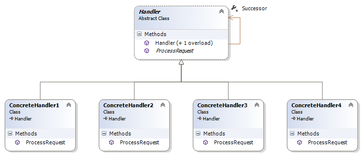
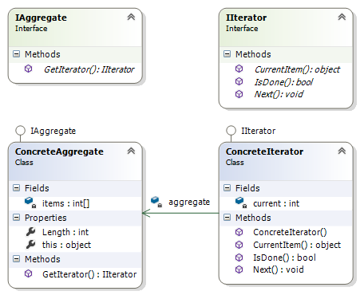
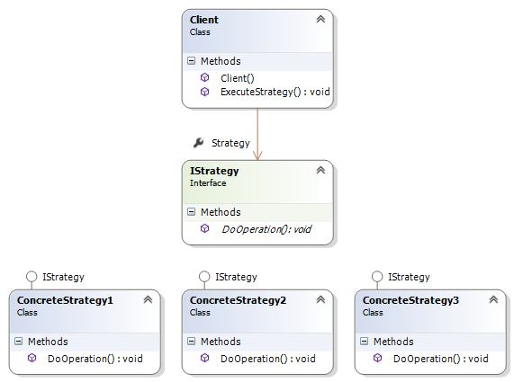

##Chain of Responsibility##

Chain of Responsibility шаблонът отговаря на **необходимостта**, определен обект да подава команда, без да знае конкретно кой ще я получи и обработи. Подадената заявка се препраща от между различни обекти, които образуват верига. Всеки обект от веригата може да обработи заявката, да я препрати или да направи и двете (в зависимост от определени услояиа, на които заявката трябва да отгоаря). 

При използването на този шаблон, **целта** е да се избегне обвързаността между обекта, подаващ комянадата (заявката) и нейния получател, като се даде възможност и на други обекти да участват в нейната обработка.
 
**Прилагането** на Chain of Responsibility е ефективно в случаите, в които една заявка може да бъде обработена от няколко обекта, в случаите, в които при подаван на заявката, не е известно кой обект може да я обработи, като това се определя автоматично, в случаите, в които заявката е насочена към група от обекти, както и в случаите, в които обектите, които могат да обработят заявката се определят динамично.

Chain of Responsibility се **използва** в много библиотеки за обработка на потребителски команди.

Chain of Responsibility се **имплементира** чрез дефинирането на Handler интерфейс, който съдържа метод, чрез който заявката се обработва. Всеки конкретен Handler наследява дефинирания интерфейс, като в метода, обработващ заявката, дефинира поведение в случай на възможност самия той да я обработи и в случай, че не може. Във втория случай, той предава заявката към следващия конкретен Handler по веригата.    

	namespace ChainOfResponsibilityDemo
	{
		using System;

    	public abstract class Handler
    	{
    	    public Handler()
    	    {
    	    }

    	    public Handler(Handler successor)
    	    {
    	        this.Successor = successor;
    	    }

    	    protected Handler Successor { get; set; }

    	    public abstract void ProcessRequest(int number);
    	}

		internal class ConcreteHandler1 : Handler
    	{
        	public override void ProcessRequest(int number)
        	{
        	    if (number <= 10)
        	    {
        	        Console.WriteLine("The request is handled by ConcreteHandler1.");
        	    }
        	    else
        	    {
        	        if (this.Successor != null)
        	        {
        	            Successor.ProcessRequest(number);
        	        }
        	    }
        	}
    	}

		internal class ConcreteHandler2 : Handler
    	{
        	public override void ProcessRequest(int number)
        	{
        	    if (number <= 20)
        	    {
        	        Console.WriteLine("The request is handled by ConcreteHandler2.");
        	    }
        	    else
        	    {
        	        if (this.Successor != null)
        	        {
        	            Successor.ProcessRequest(number);
        	        }
        	    }
        	}
    	}

		internal class ConcreteHandler3 : Handler
    	{
        	public override void ProcessRequest(int number)
        	{
        	    if (number <= 30)
        	    {
        	        Console.WriteLine("The request is handled by ConcreteHandler3.");
        	    }
        	    else
        	    {
        	        if (this.Successor != null)
        	        {
        	            Successor.ProcessRequest(number);
        	        }
        	    }
        	}
    	}

		internal class ConcreteHandler4 : Handler
	    {
	        public override void ProcessRequest(int number)
	        {
	            if (number <= 40)
	            {
	                Console.WriteLine("The request is handled by ConcreteHandler1.");
	            }
	            else
	            {
	                Console.WriteLine("The request can't be processed!");
	            }
	        }
	    }
	}

При имплементацията на Chain of Responsibility **участват** Handler интерфейса, конкретните Handler класове и клиента.

+ *Handler интерфейсът* дефинира изискванията към конкретните класове, отговорни за обработката на заявките. Той може да дефинира и връзка към следващия Handler по веригата.
+ *Конкретни Handler класове* обработват клиентските завки, които се насочват към тях или ги препращат към друг конкретен Handler (той задължително има достъп до следващия емелент от веригата).
+ *Клиентът* подава заявките, които се нуждаят от обработка .

**Следствията** от използването на Chain of Responsibility са:

+ по-малка обвързаност между класовете;
+ улеснява разширяването на отговорността за обработка на заявките на обектите, включени във веригата;
+ в случаите, в които във веригата липсва обект, който може да обработи заявката, тя остава необработена;

Структура:

## Iterator Pattern##

Iterator шаблонът отговаря на **необходимостта** от обхождане на колекции (т.е. осигуряване на достъп до всички елементи на колекциите), без значение от тяхното вътрешно представяне. При имплементирасне на Iterator шаблона, iterator обекта има грижата за обхождането на определена колекция, като следи настоящия елемент и начина, по който да бъде установен скледващия елемент.

С **прилагането** на Iterator шаблонът, се открива възможноста да бъде променена имплементацията на колекцията, без да извършването на каквито и да е промени извън нея.

С **използването** на Iterator шалонът се осигурява достъп до съдържанието на колекции, без необходимост от разкриване на вътрешната им структура. Използването на този шаблон дава възможност за имплементиране на разични начини на обхождане на колекции и дава възможност за обхождане на колекции от различен тип. 

Iterator шаблонът се **имплементира** чрез създаване на Aggregate интерфейс, който да дефинира изискване към всяка конкретна колекция да има метод за създаване на обект, имплементиращ Itrator Интерфейсът. Iterator интерфейсът дефинира методи за теущия елемент, за следващия елемент и за достигане на края на обхождания списък. Създават се и конкретни класове за Aggredator и Iterator, които имплементират двата логиката на обхождане. 

	namespace IteratorDemo
	{
		using System;

    	public interface IIterator
    	{
    	    void Next();

    	    bool IsDone();

    	    object CurrentItem();
    	}

		public interface IAggregate
    	{
        	IIterator GetIterator();
    	}

		public class ConcreteIterator : IIterator
    	{
        	private ConcreteAggregate aggregate;

        	private int current = 0;

        	public ConcreteIterator(ConcreteAggregate aggregate)
        	{
        	    this.aggregate = aggregate;
        	}

        	public void Next()
        	{
        	    this.current++;
        	}

        	public object CurrentItem()
        	{
        	    return this.aggregate[this.current];
        	}

        	public bool IsDone()
        	{
        	    return this.current >= this.aggregate.Length;
        	}
    	}

		public class ConcreteAggregate : IAggregate
    	{
        	private int[] items;

        	public int Length
        	{
        	    get
        	    {
        	        return this.items.Length;
        	    }
        	}

        	public object this[int index]
        	{
        	    get
        	    {
        	        return this.items[index];
        	    }
        	}

        	public IIterator GetIterator()
        	{
        	    return new ConcreteIterator(this);
        	}
    	}
	}

При имплементацията на Iterator шаблона **участват**:

+ *Aggregator интерфейс* - дефинира абстрактна колекция, с метод за създаване на iterator обект;
+ *Iterator интерфейс* - абстрактен итератор, дефиниращ интерфейс за достъп и обхождане на колекцията;
+ *ConcreteAggregator* -  колекция, имплементираща Aggregator ионтерфейса и даваща възможност за създаване на подходящ конкретен Iterator обект.
+ *ConcreteIterator* - имплементира Iterator интерфейса и пази текущата позиция при обхождането на ConcreteAggregate колекцията.

В **следствие** използването на Iterator Pattern се създава възможност за използване на няколко различни алгоритъма за обхождане на един вид колекции. Имплементирането на Iterator, опростява имплементацията на колекцията, като отделя логиката по обхождането й.

**Структура**

##Strategy Pattern##

**Необходимостта** от прилагане на Strategy шаблона възниква при наличие на класове, които се различават единствено по поведението си. В този случай, различните алгоритми могат да бъдат изолирани в отделни класове, което ще позволи избора на конкретен алгоритъм по време на изпълнение на програмата.

**Целта** на Strategy шаблона е дефинирането на множество алгоритми, енкапсулирани в отделни класове по начин, който ги прави взаимо заменяеми. Този шаблон позволява използването на различни алгоритми, независимо от клиетнитие, които ги използват.  

Strategy шаблонът е **приложим** в следните случаи:

+ множество свързани класове се различават само по поведението си. В стози случай, различните стратегии предоставят начин за конфигуриране на класа с един или повече видове поведение.
+ при необходимост от варианти на използваните алгоритми.
+ в случаите, в които клиентите използват данни, за които не са известни на клиентите.
+ в случаите, в които класът дефинира много различни поведения, като избора на конкретно поведение се извършва със switch или if конструкции. 

Strategy шаблонът се **имплементира** чрез дефиниране на общ интерфейс, на който трябва да отговарят всички алгоритми. Този интерфейс се имплементира от класовете, съдържащи конкретните алгоритми и се използва от клиента за извикването им.

	namespace StrategyDemo
	{
		using System;

	    public interface IStrategy
	    {
	        void DoOperation(string inputString);
	    }

		public class ConcreteStrategy1 : IStrategy
    	{
        	public void DoOperation(string inputString)
        	{
        	    Console.WriteLine("The operation done using concrete strategy 1.");
	        }
    	}

		public class ConcreteStrategy2 : IStrategy
    	{
        	public void DoOperation(string inputString)
        	{
        	    Console.WriteLine("The operation done using concrete strategy 2.");
        	}
    	}

		public class ConcreteStrategy3 : IStrategy
    	{
        	public void DoOperation(string inputString)
        	{
        	    Console.WriteLine("The operation done using concrete strategy 3.");
        	}
    	}

		public class Client
    	{
    	    public Client(IStrategy strategy)
    	    {
    	        this.Strategy = strategy;
    	    }

    	    public IStrategy Strategy { get; private set; }

    	    public void ExecuteStrategy(string inputText)
	        {
        	    this.Strategy.DoOperation(inputText);
        	}
    	}
	}

При имплементацията на Strategy шаблона **участват**:

+ *Strategy интерфейсът*, който дефинира общия интерфейс, на който трябва да отговарят конкретните алгоритми;
+ *ConcreteStrategy* класове, които имплементират отделните алгоритми;
+ *Client* - клас, който съдържа референция към обект, имплементиращ Strategy интерфейса. Клиентът може да дефинира интерфейс, който да дава достъп до данните му на конкретните Strategy обекти.

В **следствие** използването на Strategy шаблона, се постига:

+ възможност за дефиниране на множество алгоритми/поведения за клинтските обекти, които могат лесно да бъдат преизползвани;
+ чрез отделянето на алгоритмите от клиентските класове се опростява поддръжката на кода и добавянето на нови алгоритми;
+ елиминира необходимостта от използване на условни конструкции в клиентския клас.

**Структура**

